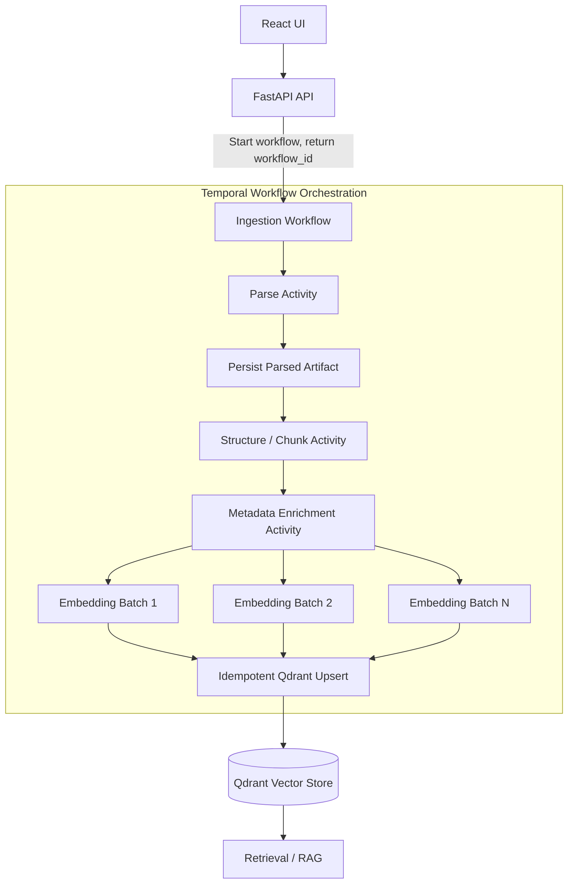

# Beyond Basic Task Queues: Building a Crash-Resilient RAG Ingestion Pipeline with Temporal

A RAG ingestion pipeline looks simple on a whiteboard:

**Parse → Chunk → Enrich → Embed → Index**

But when the document is 1-2 GB and contains 10,000+ chunks, it stops looking like a background job.

Parsing alone can take several minutes.

Embedding thousands of chunks introduces rate limits and transient failures.

Storing them in vector databases

At that point, the real engineering problem isn't just processing the document.

It's **how to make the entire workflow recoverable without repeating expensive work.**

That distinction becomes important when ingestion is no longer a 2-minute background task.

Imagine ingesting a 1-2 GB document containing 10,000+ chunks.

The pipeline might look simple:

**Parse → Chunk → Enrich → Embed → Index**

But now imagine the worker crashes after embedding chunk 8,451.

Or the embedding provider starts returning 429.

Or Qdrant becomes temporarily unavailable.

Or your API server restarts while ingestion is still running.

The real question is no longer:

"Did the job fail?"

It becomes:

**"Where can I safely resume, and how much work will I have to repeat?"**

That's where the difference between a task queue and a durable workflow engine becomes important.

## RAG Ingestion Is a Distributed Workflow

A production RAG ingestion pipeline usually contains several stages:

1. Parse the source document
2. Detect structure - sections, headings, tables, etc.
3. Generate chunks
4. Enrich metadata
5. Generate embeddings
6. Upsert vectors into Qdrant

Each stage can be expensive and can fail independently.

For a small document, treating this as one background task is perfectly reasonable.

But as the corpus grows, the pipeline becomes **long-running, stateful, and failure-prone**.

At that point, you need to answer questions such as:

- Which chunks have already been processed?
- Which chunks are currently being processed?
- Which failures are retryable?
- How should rate limits be handled?
- What happens after a worker restart?
- How do we prevent duplicate vectors?
- How much work should be repeated after a failure?

This is where things start getting interesting.

# Why Task Queues Eventually Become Complicated

Task queues such as Celery and Huey are excellent at what they are designed to do:

**execute background tasks.**

The complexity appears when you start building a long-running workflow on top of those tasks.

You may eventually introduce:

- Progress tracking
- Checkpoint files
- Database status tables
- Retry classification
- Per-chunk completion state
- Rate-limit handling
- Duplicate detection
- Resume logic
- Manual recovery mechanisms

None of these are inherently bad.

In fact, many production systems successfully use this approach.

The trade-off is that your application starts implementing its own workflow state machine.

The question then becomes:

**Should the application own all of that orchestration state, or should a workflow engine own it?**

# Enter Temporal

Temporal changes the abstraction.

Instead of thinking:

"Run this background task."

you start thinking:

**"Execute this durable workflow."**

A Temporal Workflow defines the orchestration.

Activities perform the actual work and side effects.

For example:

text id="4a8nzs" Workflow │ ├── Parse Activity ├── Structure / Chunk Activity ├── Metadata Activity ├── Embedding Activity └── Qdrant Upsert Activity

The Workflow decides **what happens next**.

The Activities perform the work that interacts with external systems.

That separation becomes particularly useful when failures occur.

# Embeddings Aren't the Only Expensive Part

When people talk about RAG ingestion failures, the discussion usually jumps straight to embeddings and LLM APIs.

But that isn't always the most expensive stage.

Document processing can be expensive too.

Libraries such as Docling may perform layout analysis, OCR, table extraction, document structure detection, and other processing before you even reach the embedding stage.

For a large or complex document, parsing and structure extraction can take several minutes.

Consider:

text id="ndm5j8" 1 GB PDF ↓ Document parsing ↓ Layout / structure extraction ↓ Chunk generation ↓ Metadata enrichment ↓ Embedding ↓ Qdrant

Now imagine the worker crashes after 15 minutes during embedding.

With coarse retry boundaries, you could end up doing this:

text id="8j0n0v" Parse document ✓ Extract structure ✓ Generate chunks ✓ Enrich metadata ✓ Generate embeddings 70% ↓ CRASH ↓ Restart ↓ Parse document again ↓ Extract structure again ↓ Generate chunks again ↓ ...

That's wasted compute before we even consider the cost of the embedding API.

This is why I prefer thinking about **every expensive stage as a potential recovery boundary**.

For example:

text id="d7i6ne" Workflow │ ├── Parse Document │ ├── Persist Intermediate Artifact │ ├── Structure / Chunk │ ├── Persist Chunk Manifest │ ├── Enrich Metadata │ ├── Embed Batch 1 ├── Embed Batch 2 ├── Embed Batch 3 │ └── Idempotent Qdrant Upsert

The goal isn't to turn every function into a Temporal Activity.

The goal is to choose **meaningful recovery boundaries**.

If parsing a 1 GB document takes 15 minutes, it may deserve a durable boundary.

If generating a small metadata field takes 20 milliseconds, it probably doesn't.

A useful design question for every stage is:

**"If this operation fails after 90% completion, how much work am I willing to repeat?"**

That answer should influence your Activity boundaries.

# Persist Expensive Intermediate Results

For expensive document processing, another useful pattern is to persist intermediate artifacts.

For example:

text id="3x6s3j" Source Document ↓ Parser ↓ Parsed Artifact ↓ Chunker ↓ Chunk Manifest ↓ Embedding Batches ↓ Qdrant

Now a worker restart doesn't necessarily mean going all the way back to the original document.

You can resume from the last meaningful boundary.

This pattern is useful beyond document parsing.

OCR, transcription, archive extraction, spreadsheet processing, image analysis, and other preprocessing stages can all become significant parts of an ingestion pipeline.

**The expensive part of a RAG pipeline isn't always the LLM.**

Sometimes it's everything you had to do before calling the LLM.

# What Happens When a Worker Crashes?

Suppose ingestion has reached chunk 8,451 of 10,000.

The worker crashes.

With a conventional task-based implementation, you may need application-level state to determine what happened:

\`\`\`text id="7z6p4r" processed_chunks.json

or

database checkpoint table

or

document status + chunk status

<br/>With Temporal, workflow execution history is durable.  
<br/>Another worker can continue executing the workflow based on that history.  
<br/>But there is an important nuance:  
<br/>\*\*Temporal does not magically persist the internal progress of an Activity.\*\*  
<br/>If one Activity processes 1,000 embeddings and crashes after 700, Temporal does not automatically know that 700 external API calls succeeded.  
<br/>That is why Activity boundaries matter.  
<br/>\---  
<br/>\# Retry Boundaries Matter  
<br/>Consider this design:  
<br/>\`\`\`text id="q9c1ly"  
EmbeddingActivity(document)  
│  
└── embed 10,000 chunks

If the Activity fails near the end, the retry boundary is the entire Activity.

Depending on how the Activity is implemented, you may repeat a large amount of work.

A better approach is to create bounded units:

text id="cb0t6a" EmbeddingActivity(batch_1) EmbeddingActivity(batch_2) EmbeddingActivity(batch_3) ... EmbeddingActivity(batch_N)

Now a failure in batch 84 does not require reprocessing batches 1-83.

This is particularly important for RAG systems because embeddings are often one of the most expensive operations in the pipeline.

# Retry Design Is Also Cost Control

Consider a pipeline with 10,000 chunks.

Suppose:

- Parsing succeeds
- Chunking succeeds
- Metadata enrichment succeeds
- 7,000 embeddings succeed
- The worker crashes while processing the remaining chunks

A coarse retry strategy can cause already-completed work to run again.

That may be acceptable for cheap operations.

It becomes much more painful when every retry involves an external embedding or LLM API.

This is why I think of retry design as having two dimensions:

**Reliability**

Can the system recover?

**Cost**

How much work must be repeated when it recovers?

A resilient RAG pipeline needs to optimize for both.

# Retry Policies Are Necessary - But Not Enough

Embedding and LLM providers can fail transiently.

Typical examples:

- HTTP 429
- Network timeout
- Temporary 5xx
- Connection reset
- Provider unavailable

Temporal Activity retry policies can handle many of these failures with exponential backoff.

Typical configuration includes:

- Initial retry interval
- Backoff coefficient
- Maximum retry interval
- Maximum attempts
- Non-retryable errors

You also need appropriate Activity timeouts, and long-running Activities may need heartbeats.

But there is another important rule:

**Not every error should be retried.**

For example:

text id="h5yw5p" Invalid document Invalid API credentials Malformed request Unsupported file format

Retrying these repeatedly doesn't make the system more resilient.

It just makes it more expensive.

# Retry Does Not Mean "Do It Again Blindly"

This is where idempotency becomes critical.

Temporal may retry an Activity.

If that Activity writes to an external system, the operation must be safe to execute more than once.

For vector ingestion, deterministic IDs are extremely useful.

For example:

text id="f7g5b6" chunk_id = SHA256( document_id + pipeline_version + section_id + chunk_index + content_hash )

The important part is not the exact formula.

The important property is:

**The same logical chunk should produce the same identity.**

Then your Qdrant write can be an idempotent upsert:

text id="z7z4km" upsert( chunk_id, vector, payload )

If the request times out after Qdrant successfully stores the vector, the Activity may retry.

Instead of creating another vector, the retry updates the same record.

That turns an uncertain external operation into a safely repeatable operation.

# Make Chunk Identity Stable

Deterministic IDs are only useful if the inputs are deterministic.

That means you should consider things such as:

- Normalized whitespace
- Stable metadata ordering
- Chunking algorithm version
- Embedding model version
- Content hash

Why version the pipeline?

Because your chunking strategy will probably change.

Today:

text id="j5wz1m" pipeline_version = v1

Tomorrow:

text id="1o8fnb" pipeline_version = v2

You may intentionally want the same source document to generate a completely different set of chunks.

Versioning the identity strategy makes that transition explicit instead of accidentally overwriting unrelated data.

# Concurrency and Rate Limits Are Different Problems

Another common mistake is assuming that retries solve rate limiting.

They don't.

Retries recover from failures.

Concurrency control prevents you from creating too many failures in the first place.

For example:

text id="qg5f8z" 100 workers ↓ 10,000 concurrent embedding requests ↓ Provider ↓ 429

Adding retries can actually make this worse.

A better design controls outbound concurrency:

text id="6j8f0f" Workflow ↓ Bounded batches ↓ Limited Activity concurrency ↓ Embedding provider

Then retries operate within those limits.

**Retry policy and concurrency control solve different problems.**

Both are required.

# A Production-Oriented Ingestion Flow

A practical architecture could look like this:

text id="3s7m3c" 1. Document discovery 2. Structure extraction 3. Chunk generation 4. Metadata enrichment 5. Content hashing 6. Embedding generation 7. Idempotent Qdrant upsert 8. Completion + progress reporting

Each expensive or failure-prone stage should have an explicit execution and retry strategy.

For large documents, prefer:

- Bounded batch sizes
- Small retry boundaries
- Deterministic IDs
- Idempotent writes
- Controlled concurrency
- Persisted intermediate artifacts where useful

And for very large workflows, consider Temporal's **Continue-As-New** to prevent workflow history from growing indefinitely.

# Don't Block the Frontend

Another architectural mistake is keeping the HTTP request alive for the entire ingestion process.

Instead, treat ingestion as an asynchronous operation.

For example:

http id="7t2k2x" POST /ingestions

returns:

http id="x4j5r3" 202 Accepted

with:

```json 
id="y7k1w4" { "workflow_id": "ingestion-12345" }

The frontend can then query:

http id="m5p8b4" GET /ingestions/{workflow_id}

and display:

text id="0f2y5s" Status: RUNNING Progress: 7,421 / 10,000
```
The frontend doesn't need to know whether the workflow is retrying a 429, waiting for a worker, or recovering from a failure.

Temporal owns that complexity.

The UI simply knows:

**Running → Completed**

or

**Running → Failed**

with appropriate progress and error information.

# Keep Storage and Orchestration Separate

Temporal should not become your application data store.

Each system should have a clear responsibility:

- Object Storage: source documents and intermediate artifacts
- Temporal: workflow orchestration and durable execution
- Qdrant: vectors and searchable payloads
- Application Database: business metadata and ingestion records

This separation makes the architecture easier to reason about.
Temporal coordinates the process.
It does not replace your document store or vector database.

# The Architecture


The important part isn't simply adding Temporal to the architecture.

It's the combination of:

**Durable workflow + meaningful recovery boundaries + bounded Activities + deterministic IDs + idempotent writes + controlled concurrency.**

That's what makes the ingestion pipeline resilient.

# Conclusion

A production ingestion system should expect:

- Worker crashes
- Process restarts
- API rate limits
- Network timeouts
- Temporary Qdrant failures
- Duplicate execution
- Partial ingestion
- Large documents
- Expensive document parsing
- Long-running workflows

The goal isn't to eliminate these failures.

That's impossible.

The goal is to make them **routine and recoverable**.

Temporal helps make workflow progress durable.

But Temporal alone doesn't make an ingestion pipeline reliable.

You still need to design the boundaries correctly.

**Durability handles recovery.**

**Idempotency handles duplicates.**

**Batching controls retry cost.**

**Concurrency limits control provider pressure.**

**Intermediate artifacts prevent expensive work from being repeated unnecessarily.**

And together, they turn a fragile 30-minute ingestion job into a workflow that can survive crashes, restarts, rate limits, and partial failures without starting from scratch.
